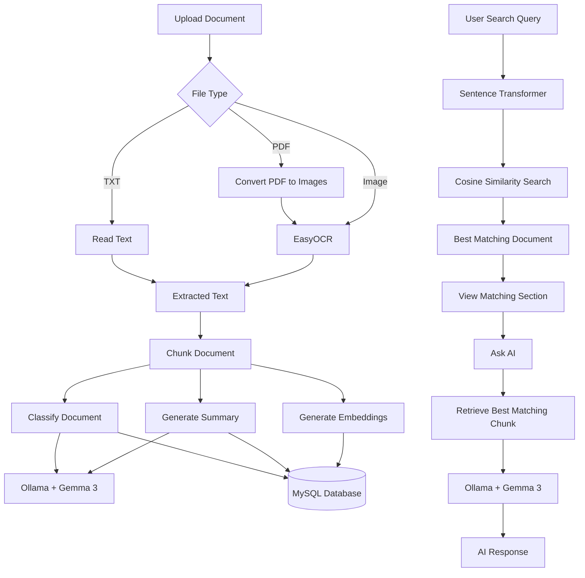

# AI Document Intelligence System 📄🤖

An AI-powered document analysis system that extracts text, generates summaries, classifies documents, and performs semantic search using local Large Language Models.

## About

AI Document Intelligence System is a Flask-based web application developed as part of the **Dev-or-Die Hackathon** at **MNNIT Allahabad**. The application enables users to upload documents, automatically extract text using OCR, generate AI-powered summaries, classify documents into relevant categories, perform semantic search across uploaded files, and ask natural language questions about document content.

Unlike traditional cloud-based solutions, this project performs AI inference locally using **Ollama** with **Gemma 3**, making document processing private and completely offline after the initial model setup. By combining OCR, vector embeddings, semantic retrieval, and a local Large Language Model, the system provides an end-to-end document intelligence workflow without relying on external AI APIs.

## Features

- 📄 **Multi-format Document Support**
  - Upload and process **PDF**, **TXT**, and image files (**PNG, JPG, JPEG**).

- 🔍 **OCR-based Text Extraction**
  - Extracts readable text from scanned documents and images using **EasyOCR**.

- 📝 **AI-powered Document Summarization**
  - Generates concise summaries using the locally hosted **Gemma 3** model through **Ollama**.

- 🏷️ **Automatic Document Classification**
  - Categorizes uploaded documents into relevant document types using AI.

- 🧩 **Chunk-based Processing**
  - Splits large documents into manageable chunks for efficient summarization and semantic search.

- 🧠 **Semantic Search**
  - Retrieves the most relevant document sections using **Sentence Transformers** and **cosine similarity**.

- 🤖 **AI-powered Question Answering**
  - Ask natural language questions about uploaded documents. The system retrieves the most relevant document section using semantic search before generating an answer with the local **Gemma 3** model.


- 💾 **Persistent Storage**
  - Stores processed documents, summaries, categories, and embeddings in a **MySQL** database.

- 📂 **Document Management**
  - View previously uploaded documents and delete them when no longer required.

- 🔒 **Offline AI Processing**
  - Uses **Ollama** for local inference, allowing AI-powered document analysis without relying on cloud APIs.

  ## Tech Stack

### Backend
- Flask

### Database
- MySQL (XAMPP)

### AI & Machine Learning
- Ollama
- Gemma 3 (Local LLM)
- Sentence Transformers (all-MiniLM-L6-v2)
- EasyOCR

### Python Libraries
- Requests
- NumPy
- pdf2image
- python-dotenv

### Development Tools
- Visual Studio Code
- Git & GitHub

## System Workflow



## Setup & Installation

### 1. Clone the Repository

```bash
git clone https://github.com/suraj-kp6/AI-Document-Intelligence-System.git
cd AI-Document-Intelligence-System
```

### 2. Create a Virtual Environment

Create a virtual environment to isolate the project's Python dependencies from other Python projects on your system.

```bash
python -m venv env
```

Activate the virtual environment:

**Windows (PowerShell)**

```powershell
.\env\Scripts\Activate.ps1
```

**Windows (Command Prompt)**

```cmd
env\Scripts\activate
```

After activation, your terminal should display `(env)` before the command prompt, indicating that the virtual environment is active.

### 3. Install Required Packages

```bash
pip install -r requirements.txt
```

### 4. Install Ollama

Download and install Ollama from the official website:

https://ollama.com/download

Pull the required model:

```bash
ollama pull gemma3:4b
```

Verify that Ollama is running:

```bash
ollama list
```

If the command displays the installed models (including `gemma3:4b`), Ollama is installed and running correctly.

### 5. Install Poppler

Download Poppler for your operating system and extract it to a preferred location.

Set the `POPPLER_PATH` environment variable in your `.env` file to the `bin` directory of the extracted Poppler folder.

Example (Windows):

```text
C:/poppler/Library/bin
```

### 6. Configure Environment Variables

Create a `.env` file in the project root by copying `.env.example`, then update the values according to your local system configuration.

### 7. Configure the Database

- Start the MySQL service using **XAMPP**.
- Create a database named **file_db**.
- Import the provided `file_db.sql` file using **phpMyAdmin**.

### 8. Run the Application

Before starting the application, make sure the **MySQL service is running** in **XAMPP**.

Then start the Flask application:

```bash
python app.py
```

Open your browser and visit:

```text
http://127.0.0.1:5000
```
